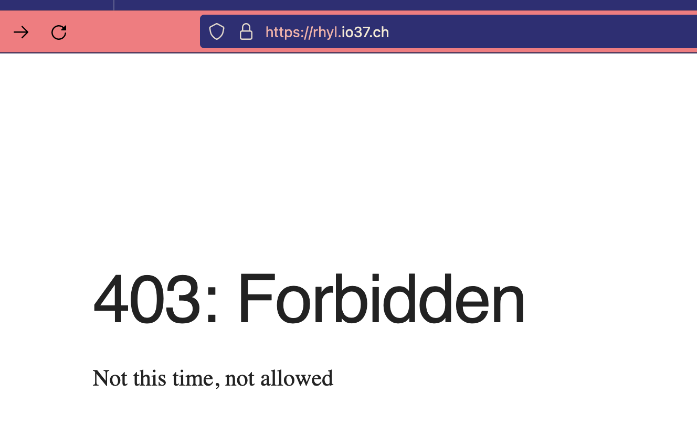

# Make Sites

Sets up nginx and certbot for a url so it is ready to deploy to

## What it does

* Adds nginx.conf for named server
* Runs letsencrypt's Cerbot to certify thte url

## Pre-requisites

Existing entries can be run via their entry in the Makefile eg `make rhyl.io37.ch`. New entries should be created with `make newsite`

Server should already be created via `make newcomputer` and `make debian` from the top level Makefile. Domain or subdomain should be resolveable correctly. This can be done with the `godaddy` command if the domain or subdomain is already owned. Otherwise, go buy it!

## How To Use

```bash
$ make rhyl.io37.ch
```

# Example runs

```bash
 make rhyl.io37.ch
ansible-playbook rhyl.io37.ch.yml -i ../hosts

PLAY [localhost] **********************************************************************************************************************

TASK [Gathering Facts] ****************************************************************************************************************
ok: [localhost]

TASK [register email] *****************************************************************************************************************
changed: [localhost]

TASK [debug] **************************************************************************************************************************

PLAY [debian] *************************************************************************************************************************

TASK [Gathering Facts] ****************************************************************************************************************
ok: [rhyl.io37.ch]

TASK [lookup subdomain ip] ************************************************************************************************************
changed: [rhyl.io37.ch]

TASK [Copy nginx conf] ****************************************************************************************************************
changed: [rhyl.io37.ch]

TASK [Creates directory] **************************************************************************************************************
changed: [rhyl.io37.ch]

TASK [certify] ************************************************************************************************************************
changed: [rhyl.io37.ch]

PLAY RECAP ****************************************************************************************************************************
localhost                  : ok=3    changed=1    unreachable=0    failed=0    skipped=0    rescued=0    ignored=0
rhyl.io37.ch               : ok=5    changed=4    unreachable=0    failed=0    skipped=0    rescued=0    ignored=0
```


```bash
make newsite
ansible-playbook ../newsite.yml -i ../hosts
What is your app_name? - supply full url if you know it: dox.io37.ch

PLAY [localhost] **********************************************************************************************************************

TASK [Gathering Facts] ****************************************************************************************************************
ok: [localhost]

TASK [Create main yml] ****************************************************************************************************************
changed: [localhost]

TASK [Create nginx template] **********************************************************************************************************
changed: [localhost]

TASK [append to makefile.] ************************************************************************************************************
changed: [localhost]

PLAY RECAP ****************************************************************************************************************************
localhost                  : ok=4    changed=3    unreachable=0    failed=0    skipped=0    rescued=0    ignored=0
```

# Results

A 403 page is shown on the index route, 404 pages are shown for all other routes. All pages are certified





# NEXT STEPS

Deploy a site to the URL
